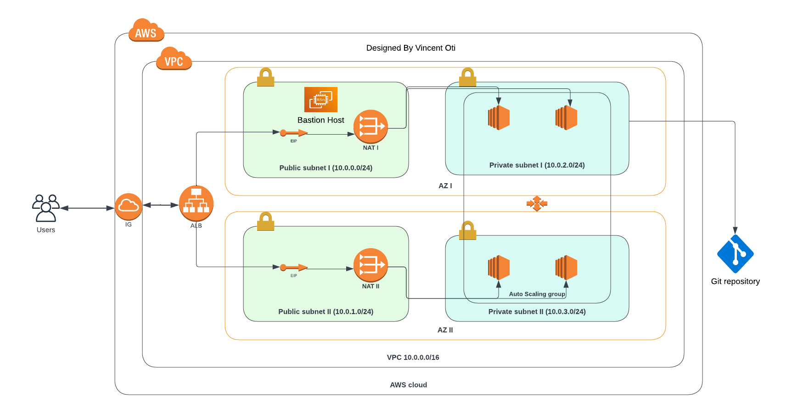

# HA Laravel Application on AWS

#### Highly available Laravel Application on AWS

Terraform and ansible code to deploy an High Availability Laravel Application in AWS using.
The infrastructure is well schematized by this picture:


## Get started

To try the infrastracture on your AWS account, make sure to configure aws cli and then run the below code from your project directory:

```
terraform init
terraform plan
terraform apply
```

## Components

The infrastructure is planned to be deployed in _eu-west-1_ zone, on two availability zones (_eu-west-1a_ and _eu-west-1b_). It is composed by the following modules:

### Networking

The networking module is based on the [vpc module](https://registry.terraform.io/modules/terraform-aws-modules/vpc/aws/latest), which with few lines of code builds up a VPC, configures subnets, the internet gateway and route tables.

### Data

The data layer builds the following components:

- RDS Aurora Cluster with two instances, one per availability zone.

### Application

The application layer builds the following components:

- An application load balancer.
- A launch configuration which installs apache, php and wordpress on Amazon Linux 2 machines.
- An autoscaling group.
- A bastion server to reach out the VMs within the autoscaling group.

